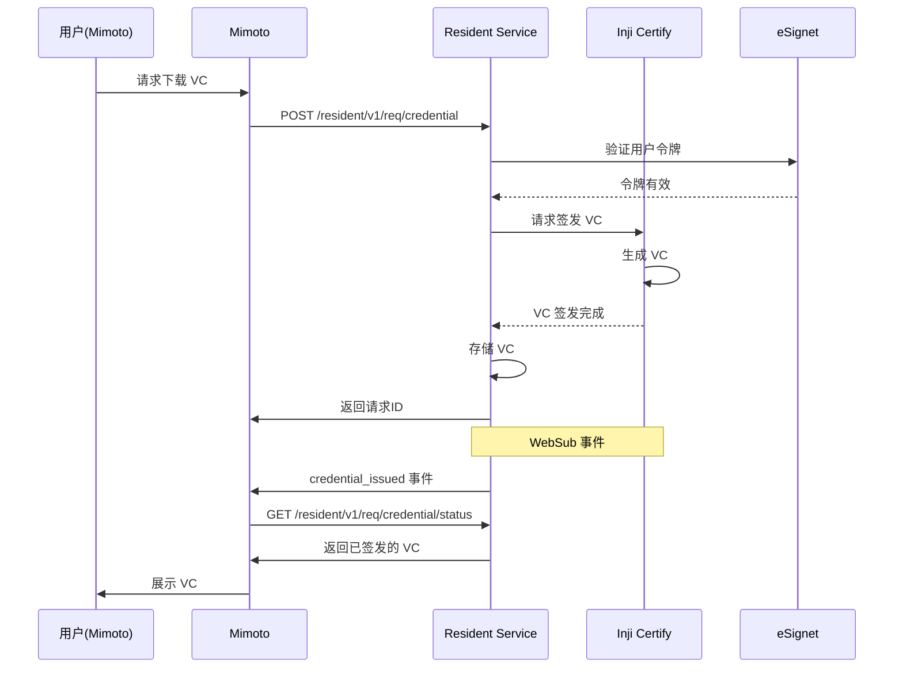

# Inji 架构中的凭证下载流程详解

## 🎯 核心问题回答

**在 Inji 架构中，凭证下载不是由 Inji Certify 服务直接负责的！**

实际上，凭证下载涉及多个服务的协作，而 **Resident Service** 是关键的协调者。

## 📋 Inji 架构中的服务角色

### 1. 🏗️ 服务职责分工

| 服务 | 职责 | 在凭证下载中的角色 |
|------|------|------------------|
| **Resident Service** | 居民服务协调者 | 🔴 **主要协调者** |
| **Inj Certify** | VC 签发服务 | 🟡 **凭证签发器** |
| **Mimoto** | VC 钱包后端 | 🟢 **客户端调用者** |
| **eSignet** | 身份认证 | 🟢 **认证提供者** |

### 2. 🔄 完整的凭证下载流程

```
┌─────────────┐
│ 用户 (Mimoto) │
└──────┬──────┘
       │
       │ 1. 请求下载 VC
       ↓
┌─────────────────────────────────────────────────────────────────┐
│                      Mimoto (钱包后端)                         │
│  POST /v1/mimoto/credentialshare/request                       │
└──────────────────────────┬────────────────────────────────────┘
                           │
                           │ 2. 调用 Resident Service
                           ↓
┌─────────────────────────────────────────────────────────────────┐
│                 Resident Service (居民服务)                   │
│  POST /resident/v1/req/credential                              │
└──────────────────────────┬────────────────────────────────────┘
                           │
                           │ 3. 协调 VC 签发
                           ↓
┌─────────────────────────────────────────────────────────────────┐
│                  Inji Certify (VC 签发服务)                    │
│  POST /v1/certify/issuance/credential                         │
│  - 验证身份                                                   │
│  - 签发 VC                                                    │
│  - 返回凭证                                                   │
└──────────────────────────┬────────────────────────────────────┘
                           │
                           │ 4. VC 签发完成
                           ↓
┌─────────────────────────────────────────────────────────────────┐
│              WebSub 事件通知 (消息队列)                         │
│  topic: credential_issued                                     │
└──────────────────────────┬────────────────────────────────────┘
                           │
                           │ 5. 通知完成
                           ↓
┌─────────────────────────────────────────────────────────────────┐
│                 Resident Service (存储 VC)                       │
└──────────────────────────┬────────────────────────────────────┘
                           │
                           │ 6. 通知可用
                           ↓
┌─────────────────────────────────────────────────────────────────┐
│                      Mimoto (钱包后端)                         │
│  /v1/mimoto/credentialshare/callback/notify                     │
└──────────────────────────┬────────────────────────────────────┘
                           │
                           │ 7. 下载 VC
                           ↓
┌─────────────┐
│ 用户 (Mimoto) │
└─────────────┘
```

## 🔍 各服务的具体作用

### Resident Service (居民服务) - **主要协调者**

**端点:** `/resident/v1/req/credential`

**职责:**
- ✅ 接收凭证下载请求
- ✅ 验证用户身份
- ✅ 协调 Inji Certify 签发 VC
- ✅ 存储/缓存签发的 VC
- ✅ 通知 Mimoto 凭证已准备好
- ✅ 处理凭证下载状态查询

**关键配置:**
```properties
mosip.resident.base.url=https://api.collab.mosip.net/resident/v1
```

### Inji Certify (VC 签发服务) - **凭证签发器**

**端点:** `/v1/certify/issuance/credential`

**职责:**
- ✅ 实现 OpenID4VCI 协议
- ✅ 验证访问令牌
- ✅ 根据身份数据签发 VC
- ✅ 支持多种 VC 格式 (JSON-LD, SD-JWT)
- ✅ 提供凭证元数据

**关键配置:**
```yaml
mosip.certify.domain.url=http://certify-nginx:80
mosip.certify.authorization.url=https://axiomid-sigate.shrwk.com
```

### Mimoto (钱包后端) - **客户端调用者**

**端点:** `/v1/mimoto/credentialshare/*`

**职责:**
- ✅ 提供钱包友好的 API
- ✅ 处理用户交互
- ✅ 调用 Resident Service
- ✅ 接收 WebSub 通知
- ✅ 向用户展示 VC

## 🎯 为什么需要 Resident Service？

### 1. **服务解耦**
```
Mimoto → 不直接调用 Inji Certify
         ↓
    Resident Service → 协调多个服务 (Inji Certify, 身份验证等)
```

### 2. **统一入口**
- Resident Service 作为统一的凭证管理入口
- 屏蔽底层签发服务的复杂性
- 提供统一的凭证状态查询

### 3. **异步处理**
- 支持长时间运行的凭证签发
- 通过 WebSub 事件通知
- 避免客户端轮询

### 4. **权限控制**
- Resident Service 处理权限验证
- 确保只有授权用户可以下载 VC
- 实现复杂的访问控制策略

## 📊 交互序列图



## 🔧 配置关系

### Mimoto 配置
```properties
# Mimoto 调用 Resident Service
mosip.resident.base.url=https://api.collab.mosip.net/resident/v1
RESIDENT_CREDENTIAL_REQUEST=${mosip.resident.base.url}/req/credential
RESIDENT_CREDENTIAL_REQUEST_STATUS=${mosip.resident.base.url}/status
```

### Inji Certify 配置
```properties
# Inji Certify 的认证端点
mosip.certify.authorization.url=https://axiomid-sigate.shrwk.com
mosip.certify.domain.url=http://certify-nginx:80
```

### Resident Service 配置
```properties
# Resident Service 可能会调用 Inji Certify
# (这些配置在 Resident Service 内部)
certify.service.url=http://certify-nginx.wallet.svc.cluster.local:80
```

## 🚀 实际调用流程

### 1. Mimoto 的调用

```java
// Mimoto 调用 Resident Service
CredentialRequestResponseDTO response = (CredentialRequestResponseDTO) restClientService
    .postApi(ApiName.RESIDENT_CREDENTIAL_REQUEST, "", "",
        mosipCredentialRequestPayload, CredentialRequestResponseDTO.class);
```

### 2. Resident Service 的处理

```java
// Resident Service 内部处理
// 1. 验证用户权限
// 2. 调用 Inji Certify 签发 VC
// 3. 存储 VC 到数据库
// 4. 发送 WebSub 事件通知
```

### 3. Inji Certify 的签发

```java
// Inji Certify 签发 VC
@PostMapping(value = "/credential")
public CredentialResponse getCredential(@RequestBody CredentialRequest credentialRequest) {
    return vcIssuanceService.getCredential(credentialRequest);
}
```

## 🎓 核心理解

### ❌ 错误理解
```
Mimoto → Inja Certify (直接调用)
         ↓
      下载 VC
```

### ✅ 正确理解
```
Mimoto → Resident Service → Inji Certify
         ↓                    ↓
      协调              签发
         ↓                    ↓
      VC 下载 ← ← ← ← ← 签发完成
```

## 🔑 关键区别

| 特性 | Resident Service | Inji Certify |
|------|------------------|---------------|
| **角色** | 协调者 | 签发器 |
| **协议** | MOSIP 内部协议 | OpenID4VCI |
| **客户端** | Mimoto | Resident Service |
| **主要功能** | 统一入口、状态管理 | VC 签发 |
| **WebSub** | 发送方 | 接收方 |
| **VC存储** | 是 | 否 |

## 💡 为什么这样设计？

### 1. **灵活性**
- 可以更换 VC 签发器而不影响钱包
- 支持多个签发器并存

### 2. **可扩展性**
- Resident Service 可以协调多种类型的服务
- 不限于 VC 签发，还可以有其他功能

### 3. **统一管理**
- 所有凭证相关操作通过 Resident Service
- 统一的状态查询和事件通知

### 4. **安全性**
- 集中的权限控制
- 统一的审计日志

## 📝 总结

### 核心要点

1. **Resident Service 是主要协调者**
   - Mimoto 调用 Resident Service
   - Resident Service 协调 Inji Certify

2. **Inji Certify 是凭证签发器**
   - 不直接被 Mimoto 调用
   - 被 Resident Service 调用

3. **凭证下载是异步流程**
   - 请求 → 签发 → 通知 → 下载
   - 通过 WebSub 事件驱动

4. **配置依赖关系**
   - Mimoto 必须配置 Resident Service
   - Resident Service 内部配置 Inji Certify
   - Mimoto 不直接配置 Inji Certify

### 架构优势

✅ **服务解耦** - 各服务职责清晰
✅ **灵活替换** - 可以更换底层实现
✅ **统一管理** - 集中的状态和事件管理
✅ **可扩展性** - 易于添加新功能

**所以，虽然 Inja Certify 负责凭证签发，但凭证下载的协调工作是由 Resident Service 完成的！**
