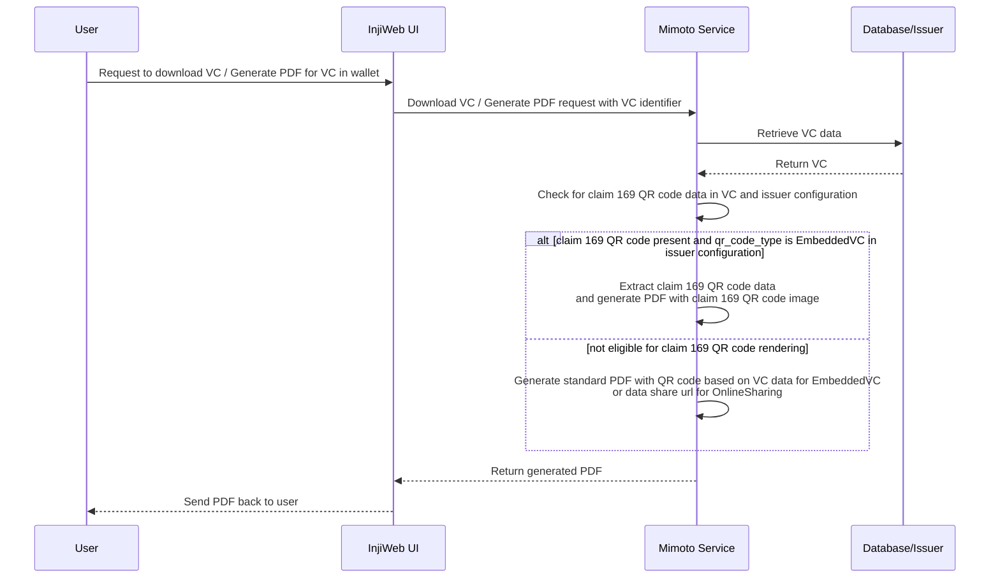

# Claim 169 QR Code Support

## Overview
Mimoto now supports consumption of claim 169 QR data present in the Verifiable Credential (VC) issued by the issuer. This feature allows users to easily access and utilize the claim 169 data for various purposes, such as displaying it in the user interface or using it for verification. Mimoto now gives preference to claim 169 QR code present in the VC while displaying and generating PDF for VCs.

## Pre-requisites
- VC should be valid and should contain claim 169 QR code data in the expected format. For e.g. for JSON-LD VC, claim 169 QR code data should be present in the `credentialSubject` section of the VC with the key `claim169`.

    ```json
      "claim169": {
      "identityQRCode": "NCF4:OCFBI%S:2EQ7NMC2558J6HW8VDQ0DW8V27MMSLYG%8WTGTEF9-8G7K6A5S+ORSWH4%F12802...",
      "faceQRCode": "NCF4:OCFBI%S:2EQ7NMC2558J6HW8VDQ0DW8V27MMSLYG%8WTSJSJGTEF9-8G7K6A5S+ORSWH4%F12802..."
      },
    ```
- The claim 169 QR code data should be in the expected format as per the requirements of the application consuming it. Refer Claim 169 QR Code specification for further details : https://docs.mosip.io/1.2.0/readme/standards-and-specifications/mosip-standards/169-qr-code-specification
- Issuer configuration should have `qr_code_type` set as `EmbeddedVC` in [mimoto-issuers-config.json](../docker-compose/config/mimoto-issuers-config.json).

## User flow :
**Note: The flow is applicable for both guest users and wallet users.**
1. User downloads the VC in guest mode or selects the VC from their wallet for PDF generation.
2. During PDF generation, Mimoto will check for the presence of claim 169 QR code data in the VC.
3. If claim 169 QR code data is present, Mimoto will extract the QR data in the first field encountered during iteration inside `claim169` object, generate QR code image and add it to the QR code placeholder in the generated PDF.
4. PDF is returned to the user.

## Sequence Diagram


## References 

- [Claim 169 QR Code Specification](https://docs.mosip.io/1.2.0/readme/standards-and-specifications/mosip-standards/169-qr-code-specification)